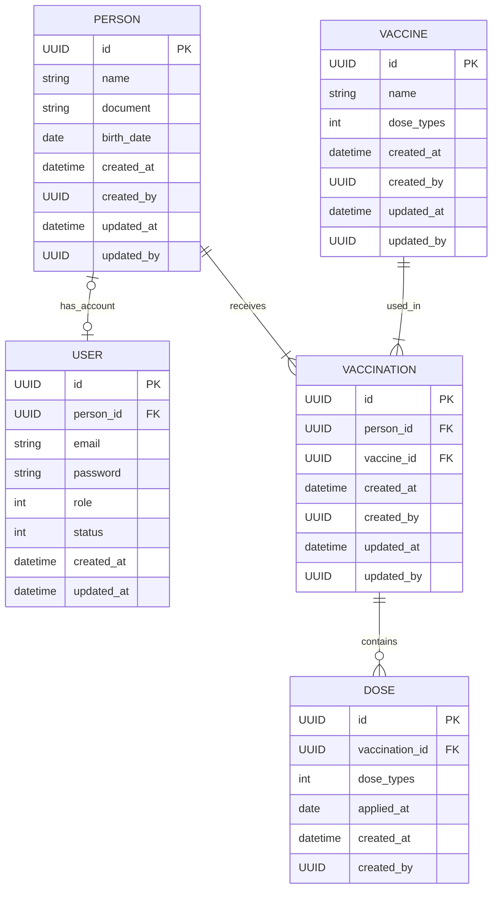

Claro 👍
Abaixo está uma **documentação consolidada, organizada e profissional**, **baseada exatamente no conteúdo que você já escreveu**, apenas melhorando **clareza, estrutura e padronização**, sem mudar a essência do projeto.

Você pode usar isso **diretamente como `README.md`**.

---

# 💉 Vaccine

Projeto de **sistema de vacinação**, desenvolvido com foco em **evolução arquitetural**, **boas práticas** e **separação de responsabilidades**.

O projeto está em constante evolução, levando em consideração:

* Crescimento da arquitetura
* Necessidade de abstrações
* Organização em camadas
* Facilidade de manutenção e testes

---

## 🧱 Arquitetura

A solução foi pensada para permitir evolução gradual, aplicando conceitos como:

* Clean Architecture (em evolução)
* Separação por camadas (Application, Domain, Infrastructure, API)
* Uso de abstrações para desacoplamento
* Validações centralizadas
* Autenticação e autorização via JWT
* Documentação automática via OpenAPI (Swagger)

---

## 🚀 Como executar o projeto

### Pré-requisitos

* Docker + Docker Compose **ou** Podman Compose
* .NET SDK (compatível com o projeto)
* Entity Framework CLI (`dotnet ef`)

---

### ▶️ Passo a passo

1. **Subir os containers**

   ```bash
   docker compose up -d
   ```

   Execute no diretório raiz da solução (`.sln`).

2. **Aplicar migrations no banco**

   ```bash
   dotnet ef database update
   ```

   Execute dentro do projeto `vaccine/vaccine`.

3. **Configurações de ambiente**

    * As variáveis de ambiente estão **hardcoded** no:

        * `appsettings.json`
        * `docker-compose.yml`
    * Isso foi feito propositalmente para facilitar a execução local.

4. **Executar a aplicação**

   ```bash
   dotnet run
   ```

5. **Acessar a documentação da API**

   ```
   http://localhost:5075/api-reference/
   ```

---

## 🧪 Executar testes

### 🔹 Testes Unitários

* Não possuem dependências externas
* Basta executar:

  ```bash
  dotnet test
  ```

### 🔹 Testes de Integração

* Requerem:

    * Docker **ou**
    * Podman Compose
* Utilizam infraestrutura real (banco, containers, etc.)

---

## 🔐 Autenticação e Autorização

* Autenticação via **JWT**
* Roles representadas como **enum com flags**
* Autorização aplicada por:

    * Middleware
    * Policies
    * Attributes (`[Authorize]`)
* Claims do token são processadas e injetadas via `RequestInfo`

---

## 🗄️ Diagrama do Banco de Dados

### 📊 Diagrama ER


---

### 🧩 Diagrama como código

<details>
<summary>Visualizar diagram as code</summary>



</details>

---

## 🧭 Próximos passos

* Melhorar responsábilidade dos endpoint/services
* Refresh Token
* Versionamento de API mais avançado
* Auditoria de ações
* Cache distribuído
* Observabilidade (logs estruturados, tracing)

## Refs:
- [principal](https://gist.github.com/DouglasLutz/aa25728e3a438dc966490870f03cc770)